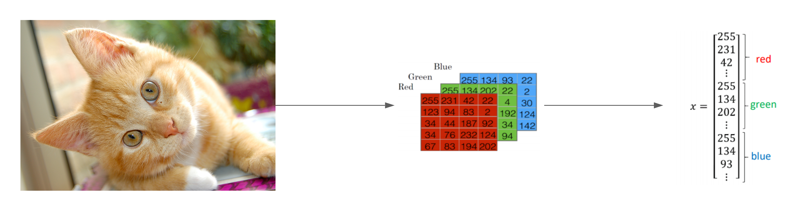
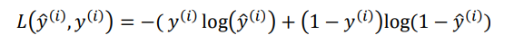
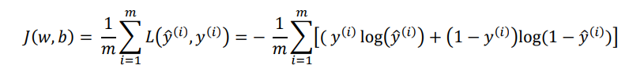
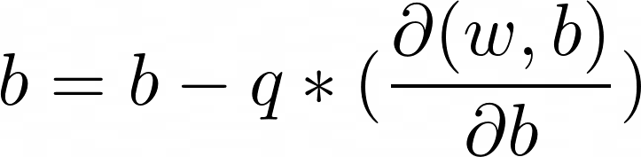

# Neural network implementation (from scratch) for binary classification
This is a binary classifier that uses a convoluted neural network to classify whether a picture is a cat or a dog.

The binary classifier accepts a picture of a cat/dog as its input and returns either 0 (it's a cat) or 1 (it's a dog) as the output.

## Picture to vector
The classifier first converts a 64x64 px image into three matricies. Each matrix represents the intensity of the amount of red, green and blue for a specific pixel in an image.

Afterwards, the three matricies are stacked together to form an input feature vector denoted as "x".

## Network architecture

Initial iterations of this project utilized logistic regressions and tanh functions as the hidden layer. However, it was observed that for large inputs to the activation function, the gradient became very small making the learning rate very slow. For now, the RELU activation function is used for the hidden layers. For the output layer, a logistic regression is used since the range of the function in between 0 and 1 making it a suitable choice to represent the probability of a picture being a dog. 1 denotes with 100% probability that the picture is a dog and 0 denote 0% probability being a dog (hence the picture is a cat).

## Initializing the Network
For the network, all the weights are initally randomly assigned a value. Note that if all the neurons were assigned the same starting value, say 0, all of the neurons would be performing the same computation making a multi-neuron layer redundant.

## Forward Propagation
To compute the value for a particular neuron, we simply take the weighted sum of each of the input neurons plus a constant bias for that layer.

For the loss function, the "Cross Entropy Loss Function" is used for the network because the graph is convex yielding a unique minimum point. For the "i-th" training example, let "y-hat-i" be the predicted value of whether the picture is a cat/dog and "y-i" be the actual result of whether the picture is a cat/dog then the loss function for a particular example is computed as follow.

To compute the total cost function over all the example we then attempt to minimize the average of the loss function over all training examples.
Let "J(w,b)" be the cost function. The cost function accepts the tensor "W" holding the weights of all the neurons in the network and a row vector "b" representing the weights for each of the layers. The values "W" and "b" are used to compute "y-hat-i" which is the prediction of the neural network. Then the cost function is computed as follow

## Backward Propagation
For the backward propagation, the partial derivatives of the cost function J(w,b) is computed with respect to all the internal parameters of the neural network, those parameters being the weights of all neurons and the bias for each of the layers. Lastly, the parameters are updated by subtracting the learning rate * the derivative of J with respect to the variables.
For example, let "b" be a parameter representing the bias and "q" be the learning rate. The new "b" would be computed as follow

